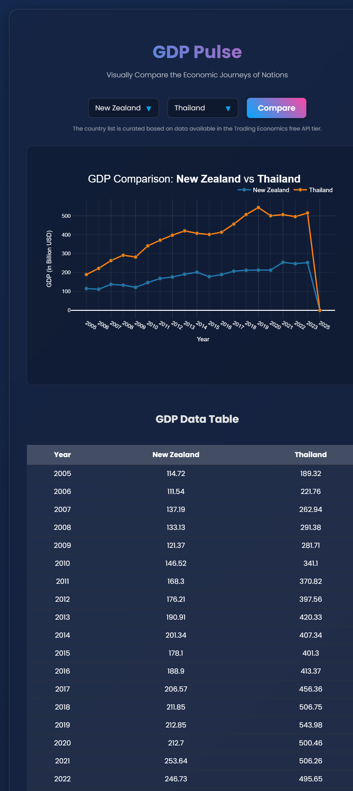

# GDP Pulse: A Country Comparison App

This web application was developed as a technical task for Trading Economics. It provides a user-friendly interface to visually compare the historical annual Gross Domestic Product (GDP) of two countries.

The application is built with Python and Flask on the backend, and the frontend is styled with modern CSS for a responsive and engaging user experience.




## Key Features

-   **Interactive GDP Comparison Chart**: Dynamically generates a line chart using Plotly to visualize the GDP trends of two selected countries over the last 20 years.

-   **Tabular Data Display**: Below the chart, a clean table presents the raw GDP data year-by-year for easy comparison and analysis.

-   **Export to CSV**: Users can download the comparison data displayed in the table as a `.csv` file with a single click, allowing for offline analysis.

-   **Curated Country List**: The application exclusively uses data for **Sweden, Mexico, New Zealand, and Thailand**. This list was curated based on testing to ensure data reliability and availability within the Trading Economics free API tier.

-   **Modern, Responsive UI**: The interface is designed to be visually appealing and functional on all screen sizes, featuring an animated gradient background and "glassmorphism" card effects.

-   **API Error Handling**: Includes robust error handling to inform the user if API data cannot be retrieved, for instance, during a temporary service outage.

## API Endpoint Used

This application fetches data from the Trading Economics historical data endpoint:
- `https://api.tradingeconomics.com/historical/country/{country}/indicator/gdp`

## Setup and How to Run

Follow these steps to run the application locally.

1.  **Clone the repository:**
    ```bash
    git clone https://github.com/mohdfarseen/tradingeconomics.git
    cd tradingeconomics/gdp_comparison_app
    ```
   

2.  **Install dependencies:**
    It is recommended to use a virtual environment.
    ```bash
    # Create and activate a virtual environment (optional but recommended)
    python -m venv venv
    source venv/bin/activate  # On Windows, use `venv\Scripts\activate`

    # Install required packages
    pip install Flask requests plotly
    ```

3.  **API Key:**
    The application uses a hardcoded API key in `app.py`. Ensure your API key is present.

4.  **Run the application:**
    ```bash
    python app.py
    ```

5.  **View in browser:**
    Open your web browser and navigate to `http://127.0.0.1:5000`.

## Project Structure


gdp_comparison_app/
├── app.py # Main Flask application, handles routing and data fetching
├── templates/
│ └── index.html # Frontend Jinja2 template for UI, chart, and table
├── finalresult.png # Final result screenshot of the app
├── GDP_Comparison_App.mp4 # Video of the application running
├── README.md # This file
├── screenshot1.png # A screenshot of the running application
├── screenshot2.png
├── screenshot3.png
├── screenshot4.png
└── screenshot5.png